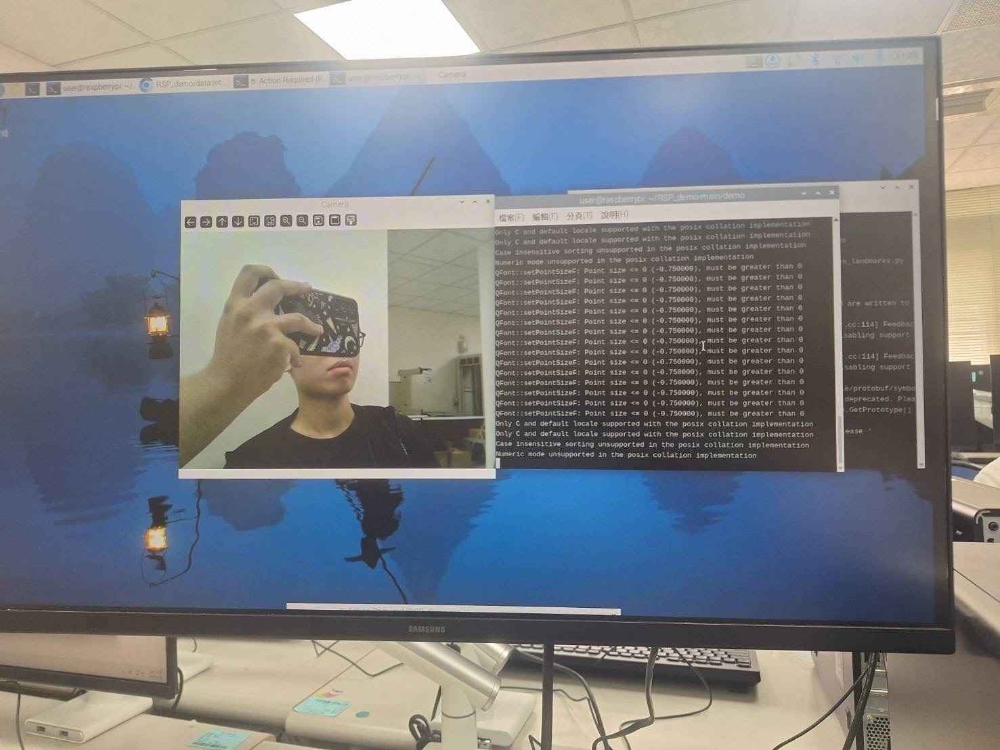
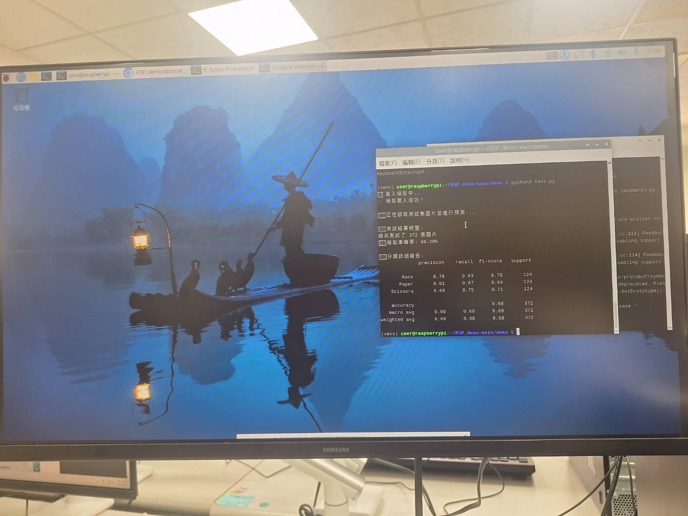

# 物聯網 HW4 結案報告：手勢辨識模型實作與比較

## Part 1. Raspberry Pi 4 執行測試
以下是在 Raspberry Pi 4 上執行 `test.py` 與 `carema.py` 的實機測試截圖：

---

## Part 2. Demo 展示影片
我們選擇了表現較佳的模型（MobileNet）並撰寫了 `camera_demo.py` 來接收相機畫面即時分類。
本專案已支援辨識 4 種手勢：
1. 石頭 (Rock)
2. 剪刀 (Scissors)
3. 布 (Paper)
4. 其他錯誤手勢 (Error)

*(請將您錄製的 10 次手勢辨識 demo 短片附在報告繳交處，或參考專案內的 `demo_vid.mp4`)*

---

## Part 3. 模型比較與架構說明

### 1. 兩個模型架構修改與結果呈現
本專案實作了兩種不同的深度學習模型架構來進行手勢辨識：**自訂 CNN 模型**與**基於 MobileNetV2 的遷移學習模型**。
我們在 `train_cnn.py` 與 `train_mobilenet.py` 中皆使用了 `sklearn.metrics.classification_report`，這能夠完整輸出 Accuracy, Precision, Recall, 與 F1-score 等評估指標。

**(1) 自訂 CNN (Convolutional Neural Network) 模型**
* **架構**：使用了 3 層卷積層 (Conv2D) 搭配池化層 (MaxPooling2D)，最後接上 Flatten 與 Dense 層，並加入 Dropout (0.5) 防止過擬合。
* **表現**：詳細評估指標請見根目錄的 `cnn_result.jpg`。

**(2) MobileNetV2 遷移學習模型**
* **架構**：載入預先訓練於 ImageNet 的 MobileNetV2 作為特徵提取器（凍結其權重 `trainable = False`），並在其後方加上 `GlobalAveragePooling2D` 與自訂的 `Dense` 輸出層進行 4 個類別的分類。
* **表現**：詳細評估指標請見根目錄的 `mobilenet_result.jpg`。

---

### 2. 更換模型原因及比較差異
**為什麼選擇這兩個模型？它們的差異為何？**

1. **自訂 CNN (輕量化基準點)**
   * **原因**：自訂的 CNN 模型可以作為一個 Baseline（基準模型）。它的優點是架構簡單、運算量小，適合快速訓練與部署在資源受限的邊緣裝置（例如 Raspberry Pi）上。
   * **差異 / 缺點**：因為是從零開始訓練（Train from scratch），在資料集不夠龐大或背景光源複雜的情況下，特徵提取能力較弱，容易受到環境干擾而導致辨識率下降。

2. **MobileNetV2 (強健特徵提取)**
   * **更換原因**：為了改善自訂 CNN 在實際應用（如相機即時捕捉）時容易受背景或光線影響的問題，我們更換為 MobileNetV2 進行遷移學習。MobileNetV2 原本就是為了行動裝置與邊緣運算設計的輕量級深度學習模型。
   * **差異 / 優點**：因為 MobileNet 已經在龐大的 ImageNet 資料集上訓練過，具備非常強的「通用特徵提取能力」。這使得它在面對我們的手勢圖片時，即使資料量不大，也能快速收斂，且對於不同的手部特徵、膚色或背景雜訊有更高的 Robustness（強健性），在實機 demo 時預測更穩定。因此我們在最終的 `camera_demo.py` 中選擇它作為主要推論模型。

---

### 3. 程式碼與 AI 協作對話
* **程式碼**：所有訓練指令 (`train_cnn.py`, `train_mobilenet.py`) 與攝影機推論程式 (`camera_demo.py`) 皆已附於專案 `train/` 資料夾中。
* **AI 協作對話紀錄**：開發過程的 AI 討論紀錄已匯出為 PDF 檔案（請見 `Claude_chat.pdf` 與 `Gemini_chat.pdf`）。
